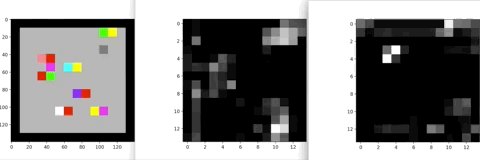
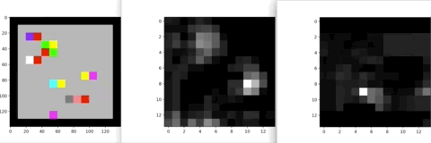

# Relational Deep Reinforcement Learning
## Requirements
- Python: 3.6.1
- Tensorflow: 1.11.0
- Tensorboard:1.11.0
- OpenAI Gym: 0.15.4
- [stable-baselines](https://github.com/hill-a/stable-baselines), commit hash: 98257ef8c9bd23a24a330731ae54ed086d9ce4a7a1ab7a1c2903e7e1c38756d8cdf7a54a5fd5781e.
    - Already exists in the project, but you need to install the dependencies of stable_baselines


The versions are just what I used and not necessarily strict requirements.
### Install boxworld environment
Go to the `env/gym-box-world` folder and run the command :
```
pip install -e .
```

This will install the box-world environment. Now, you can use this enviroment with the following:
```
import gym
import gym_boxworld
env_name = 'BoxRandWorld'
env_id = env_name + 'NoFrameskip-v4'
env = gym.make(env_id,level='easy')
```
[More details about the Env](https://github.com/gyh75520/Relational_DRL/blob/master/env/gym-box-world/README.md)

## How to Run
All training code is contained within ```main.py```. To view options simply run:
```
python main.py --help
```
An example:
```
python main.py BoxRandWorld -env_level easy RelationalLstmPolicy
```
## Experiment result


###BoxRandWorld, level = easy, head = 2
The following is the relation(attention) weight diagram of the agent
> 0:Dark
> 1:White

The greater the weight, the more the color tends to be white


